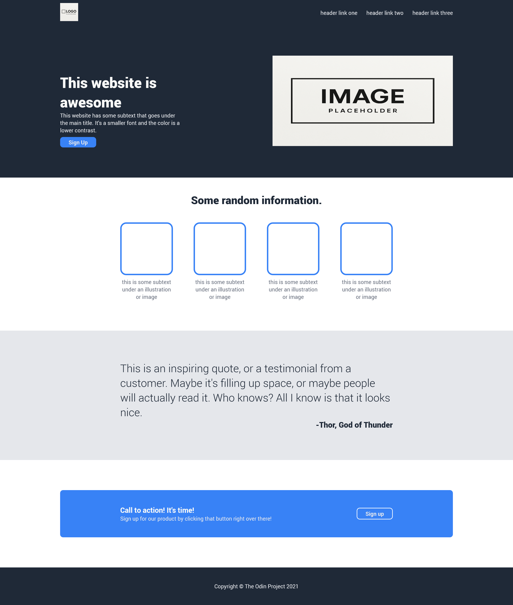

# 🌐 Landing Page Project

A clean and responsive **Landing Page** built as part of [The Odin Project: Foundations](https://www.theodinproject.com/lessons/foundations-landing-page).  
This project demonstrates **HTML & CSS fundamentals**, focusing on layout, typography, and responsive design with Flexbox.

---

## 📸 Preview

  
*(Add a screenshot of your page here — place it in the `images` folder and update the path if needed.)*

---

## 🚀 Live Demo

🔗 [View the Live Site](https://empyreanbreaker.github.io/landing-page/)  

---

## 🛠️ Built With
- **HTML5** – semantic structure  
- **CSS3** – custom styling  
- **Flexbox** – flexible, responsive layouts  

---

## 📚 What I Learned
- Structuring a webpage with semantic HTML  
- Using **Flexbox** for alignment and spacing  
- Creating a **consistent design system** (colors, typography, spacing)  
- Building a responsive layout that adapts to different screen sizes  

---

## ⚡ Getting Started
To view this project locally:

To view this project locally:

1. Clone the repository:
2. Open `index.html` in your browser.

---

## 🎯 Future Improvements

* Add CSS animations and hover effects
* Improve accessibility (ARIA labels, skip links, contrast checks)
* Refactor styles with CSS variables or utility classes

---

## 🙌 Acknowledgments

This project was created as part of the **[The Odin Project](https://www.theodinproject.com/)** Foundations curriculum.  
Thanks to:  
- **The Odin Project community** for providing structure and support  
